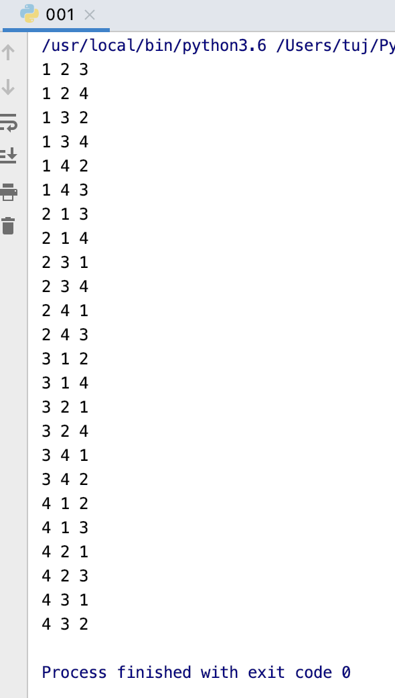
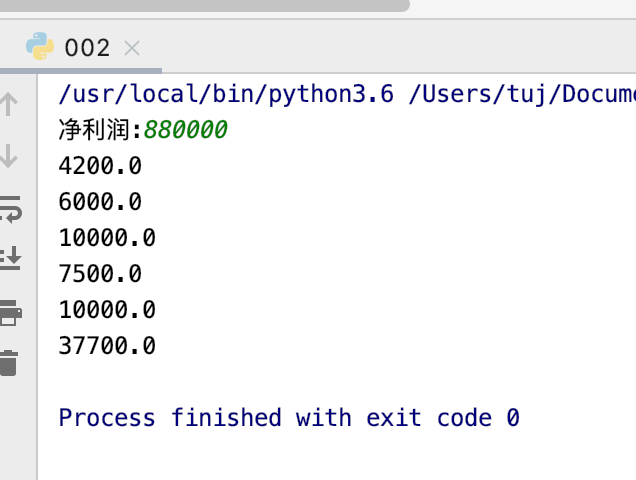
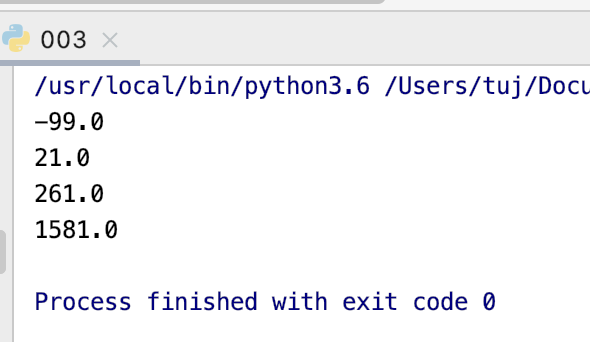
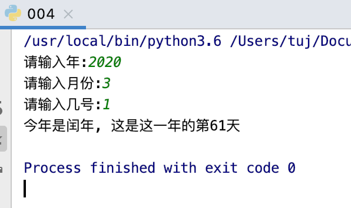
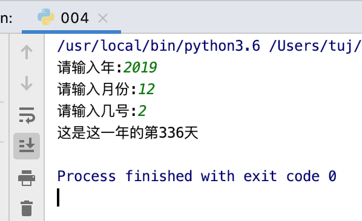

# 1-10题
***
## 第一题
题目：有四个数字：1、2、3、4，能组成多少个互不相同且无重复数字的三位数？各是多少？

程序分析：可填在百位、十位、个位的数字都是1、2、3、4。组成所有的排列后再去 掉不满足条件的排列。

程序源代码：
```
#!/usr/bin/python3

intlist = [1,2,3,4]
for i in intlist:
    for j in intlist:
        for k in intlist:
            if i != j and j != k and i!= k:
                print(i,j,k)
```   
   
运行结果:
      
   
## 第二题
题目：企业发放的奖金根据利润提成。利润(I)低于或等于10万元时，奖金可提10%；利润高于10万元，低于20万元时，低于10万元的部分按10%提成，高于10万元的部分，可提成7.5%；20万到40万之间时，高于20万元的部分，可提成5%；40万到60万之间时高于40万元的部分，可提成3%；60万到100万之间时，高于60万元的部分，可提成1.5%，高于100万元时，超过100万元的部分按1%提成，从键盘输入当月利润I，求应发放奖金总数？

程序分析：请利用数轴来分界，定位。注意定义时需把奖金定义成长整型。

程序源代码：
```
#!/usr/bin/python3
#coding=utf-8

i = int(input('净利润:'))
arr = [1000000, 600000, 400000, 200000, 100000, 0]
rat = [0.01, 0.015, 0.03, 0.05, 0.075, 0.1]
r = 0
for idx in range(0, 6):
    if i > arr[idx]:
        r += (i - arr[idx]) * rat[idx]
        print((i - arr[idx]) * rat[idx])
        i = arr[idx]
print(r)

```   
   
运行结果:   
   
   
## 第三题
题目：一个整数，它加上100后是一个完全平方数，再加上168又是一个完全平方数，请问该数是多少？

程序分析：假设该数为 x。

1、则：x + 100 = n2, x + 100 + 168 = m2
2、计算等式：m2 - n2 = (m + n)(m - n) = 168
3、设置： m + n = i，m - n = j，i * j =168，i 和 j 至少一个是偶数
4、可得： m = (i + j) / 2， n = (i - j) / 2，i 和 j 要么都是偶数，要么都是奇数。
5、从 3 和 4 推导可知道，i 与 j 均是大于等于 2 的偶数。
6、由于 i * j = 168， j>=2，则 1 < i < 168 / 2 + 1。
7、接下来将 i 的所有数字循环计算即可。

程序源代码：
```
#!/usr/bin/python3

for i in range(1,85):
    if 168 % i == 0:
        j = 168/i
        if  i > j and (i + j) % 2 == 0 and (i - j) % 2 == 0 :
            m = (i + j) / 2
            n = (i - j) / 2
            x = n * n - 100
            print(x)
```   
   
运行结果:   
      
   
## 第四题
题目：输入某年某月某日，判断这一天是这一年的第几天？

程序分析：以3月5日为例，应该先把前两个月的加起来，然后再加上5天即本年的第几天，特殊情况，闰年且输入月份大于2时需考虑多加一天：

程序源代码：
```
#!/usr/bin/python3

year = int(input("请输入年:"))
month = int(input("请输入月份:"))
day = int(input("请输入几号:"))

leapyear = [0,31,29,31,30,31,30,31,31,30,31,30,31]
normalyear = [0,31,28,31,30,31,30,31,31,30,31,30,31]

days = 0
i = month

if year%4 == 0:
    for temp in range(0,i,1):
        days += leapyear[temp]
    print("今年是闰年, ",end="")
else:
    for temp in range(0,i,1):
        days +=  normalyear[temp]

days = days + day
print('这是这一年的第%d天'%days)

```   
   
   
   
      
   
## 第五题
题目：输入三个整数x,y,z，请把这三个数由小到大输出。

程序分析：我们想办法把最小的数放到x上，先将x与y进行比较，如果x>y则将x与y的值进行交换，然后再用x与z进行比较，如果x>z则将x与z的值进行交换，这样能使x最小。

程序源代码：


## 第六题
题目：斐波那契数列。

程序分析：斐波那契数列（Fibonacci sequence），又称黄金分割数列，指的是这样一个数列：0、1、1、2、3、5、8、13、21、34、……。

在数学上，费波那契数列是以递归的方法来定义：


## 第七题
题目：将一个列表的数据复制到另一个列表中。

程序分析：使用列表[:]。

程序源代码：


## 第八题
题目：输出 9*9 乘法口诀表。

程序分析：分行与列考虑，共9行9列，i控制行，j控制列。

程序源代码：


## 第九题
题目：暂停一秒输出。

程序分析：使用 time 模块的 sleep() 函数。

程序源代码：


## 第十题
题目：暂停一秒输出，并格式化当前时间。

程序分析：无。

程序源代码：


