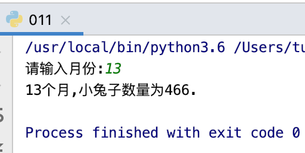
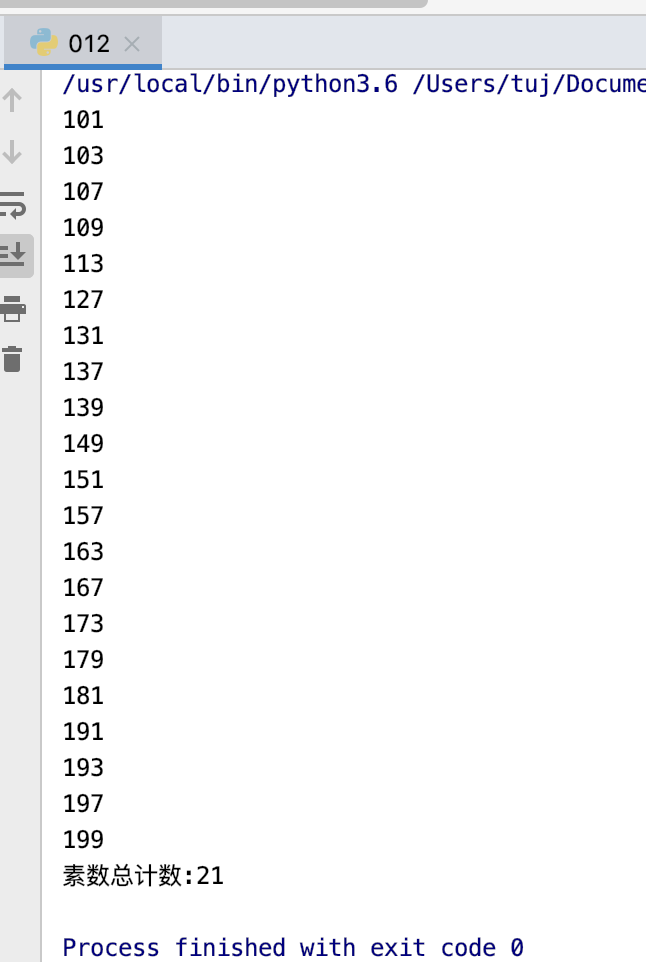
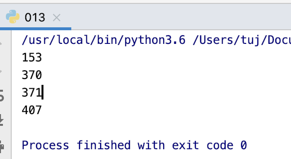
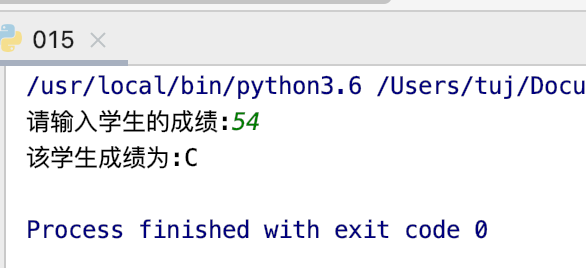
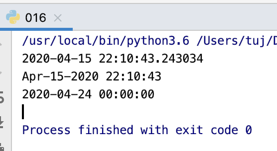
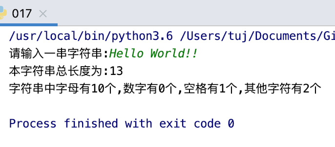
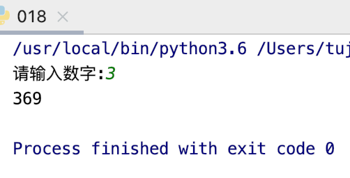
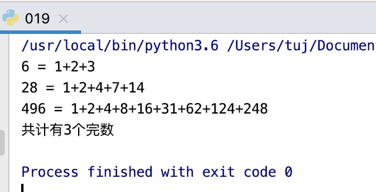
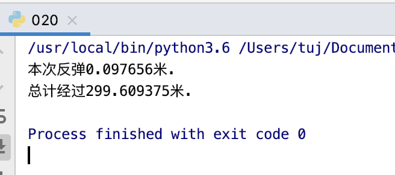

# 11-20题
***
## 第十一题
题目：古典问题：有一对兔子，从出生后第3个月起每个月都生一对兔子，小兔子长到第三个月后每个月又生一对兔子，假如兔子都不死，问每个月的兔子总数为多少？

程序分析：兔子的规律为数列1,1,2,3,5,8,13,21....

程序源代码：
```
#!/usr/bin/python3

def fibo(num):
    a = 0
    b = 1
    for i in range(num):
        a, b = b, (a+b)
    print("%d个月,小兔子数量为%d. "%(num,a*2))

num = int(input("请输入月份:"))
fibo(num)
```   
   
运行结果:   
   
   
## 第十二题
题目：判断101-200之间有多少个素数，并输出所有素数。

程序分析：判断素数的方法：用一个数分别去除2到sqrt(这个数)，如果能被整除，则表明此数不是素数，反之是素数。 　　　　　

程序源代码：
```
#!/usr/bin/python3
import math
count = 0
leap = 1

for i in range(101,201):
    k = int(math.sqrt(i+1))
    for j in range(2,k+1):
        if i%j == 0:
            leap = 0
            break
    if leap == 1:
        print(i)
        count += 1
    leap = 1

print("素数总计数:%d"%count)

```   
   
运行结果:   
   
   

## 第十三题
题目：打印出所有的"水仙花数"，所谓"水仙花数"是指一个三位数，其各位数字立方和等于该数本身。例如：153是一个"水仙花数"，因为153=1的三次方＋5的三次方＋3的三次方。

程序分析：利用for循环控制100-999个数，每个数分解出个位，十位，百位。

程序源代码：
```
#!/usr/bin/python3

for num in range(100,1000):
    # 方法一
    strnum = str(num)
    i = int(strnum[0])
    j = int(strnum[1])
    k = int(strnum[2])
    if i*i*i + j*j*j + k*k*k == num:
        print(num)

    # 方法二
    i = int(num/100)
    j = int(num/10%10)
    k = num%10
    if num == i ** 3 + j ** 3 + k ** 3:
        print(num)
```
   
运行结果:   
     
   
## 第十四题
题目：将一个正整数分解质因数。例如：输入90,打印出90=2*3*3*5。

程序分析：对n进行分解质因数，应先找到一个最小的质数k，然后按下述步骤完成：
(1)如果这个质数恰等于n，则说明分解质因数的过程已经结束，打印出即可。
(2)如果n<>k，但n能被k整除，则应打印出k的值，并用n除以k的商,作为新的正整数你n,重复执行第一步。
(3)如果n不能被k整除，则用k+1作为k的值,重复执行第一步。

程序源代码：
```
#!/usr/bin/python3

n=int(input('请输入一个整数:'))
n1=n
l=[]
while n>1:
    for i in range(2,int(n+1)):
        if n%i==0:
            n=n/i
            l.append(str(i))
            break

print('%d=' %n1 + '*'.join(l))

```
   
运行结果:   
   
   
## 第十五题
题目：利用条件运算符的嵌套来完成此题：学习成绩>=90分的同学用A表示，60-89分之间的用B表示，60分以下的用C表示。

程序分析：程序分析：(a>b)?a:b这是条件运算符的基本例子。

程序源代码：
```
#!/usr/bin/python3

def grade(num):
    if num >= 90:
        return "A"
    elif num >= 60:
        return "B"
    else:
        return "C"

num = int(input('请输入学生的成绩:'))
print("该学生成绩为:%s"%(grade(num)))
```   
   
运行结果：    
   
   

## 第十六题
题目：输出指定格式的日期。

程序分析：使用 datetime 模块。
```
#!/usr/bin/python3

import datetime

# 返回当前系统时间
print(datetime.datetime.now())

# 日期格式转化为字符串格式
print(datetime.datetime.now().strftime('%b-%d-%Y %H:%M:%S'))

# 打印指定日期
print(datetime.datetime(2020,4,24))
```   
   
运行结果:   
   

## 第十七题
题目：输入一行字符，分别统计出其中英文字母、空格、数字和其它字符的个数。

程序分析：利用 while 或 for 语句,条件为输入的字符不为 '\n'。
```
#!/usr/bin/python3

strA = input("请输入一串字符串:")

number = 0
space = 0
alpha = 0
other = 0

for i in strA:
    if i.isnumeric() == True:
        number += 1
    elif i.isspace() == True:
        space += 1
    elif i.isalpha() == True:
        alpha += 1
    else:
        other += 1
print('本字符串总长度为:%d'%(len(strA)))
print("字符串中字母有%d个,数字有%d个,空格有%d个,其他字符有%d个"%(alpha, number, space, other))
```
   
运行结果:   
   
   
## 第十八题
题目：求s=a+aa+aaa+aaaa+aa...a的值，其中a是一个数字。例如2+22+222+2222+22222(此时共有5个数相加)，几个数相加由键盘控制。

程序分析：关键是计算出每一项的值。

程序源代码：
```
#!/usr/bin/python3

n = int(input('请输入数字:'))
a = n
sum = 0
total = 0
for i in range(n):
    sum += (10 ** i)
    total += sum * a
print(total)
```
   
运行结果:      
     
   
## 第十九题
题目：一个数如果恰好等于它的因子之和，这个数就称为"完数"。例如6=1＋2＋3.编程找出1000以内的所有完数。

程序分析：请参照程序Python 练习实例14。

程序源代码：
```
#!/usr/bin/python3
s1 = "+"
list2 = []
list3 = []
for x in range(1, 1001):
    list1 = []
    list3 = []
    for i in range(1, int(x / 2) + 1):
        if x % i == 0:
            list3.append(i)
            i = str(i)
            list1.append(i)
    if x == sum(list3):
        print("%d = "%x, end="")
        print(s1.join(list1))

        list2.append(x)
print("共计有%d个完数"%(len(list2)))
```
   
   
   
   

## 第二十题
题目：一球从100米高度自由落下，每次落地后反跳回原高度的一半；再落下，求它在第10次落地时，共经过多少米？第10次反弹多高？

程序分析：无

程序源代码：
```
#!/usr/bin/python3

def bounce(num):
    global a
    height = 100
    listHeight = []
    for i in range(1,num+1):
        height /= 2
        listHeight.append(height)
        a = (sum(listHeight) - listHeight[-1])*2 + 100

    print("本次反弹%f米."%height)
    print("总计经过%f米."%(a))

bounce(10)
```
   
运行结果:    
   